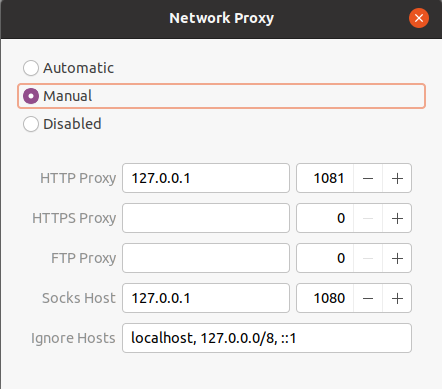
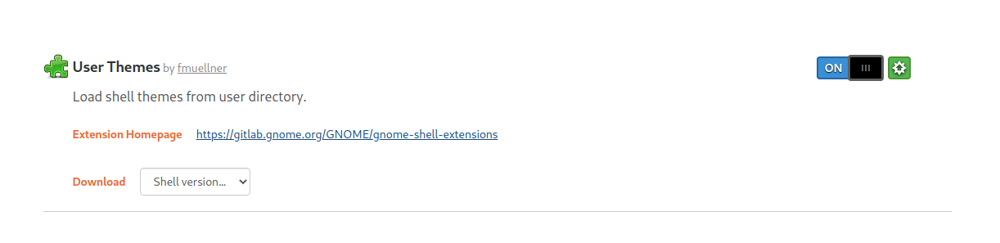

Ubuntu又又又崩溃了，得重装。这次的post主要记录一下安装过程以及其中碰到的坑

### 1. 关于安装启动盘

启动盘不建议直接在windows上用rufus创建（我装了两次都安装不了）。可以的话直接用ubuntu自带的**`startup disk creator`**在usb上创建安装。具体的过程略

### 2. 更新ubuntu的软件源

- 搜索`software & update`并将软件源设置为国内aliyun

- `sudo apt update`

### 3. 安装vim

- `sudo apt install vim`

- vim的设置参考<https://github.com/amix/vimrc>

### 4. 安装chrome

虽然google不能直接访问，浏览器还是可以用的

### 5. 安装git

- `sudo apt install git`
- 生成ssh的密钥：`ssh-keygen`
- 在github账户上设置生成的公钥`~/.ssh/id_rsa.pub`

### 6. 安装terminator & zsh

- `sudo apt install terminator`
- `sudo apt install zsh`
- 安装oh-my-zsh，链接<https://github.com/ohmyzsh/ohmyzsh> 选择喜欢的主题(我用的[zeta](https://github.com/skylerlee/zeta-zsh-theme/blob/master/zeta.zsh-theme))
- plugins: [syntax-highlight](https://github.com/zsh-users/zsh-syntax-highlighting), [auto-suggestions](https://github.com/zsh-users/zsh-autosuggestions), [k](https://github.com/supercrabtree/k)

### 7. 安装anaconda

- 使用清华源下载：<https://mirrors.tuna.tsinghua.edu.cn/anaconda/archive/>
- 安装后在.zshrc中设置anaconda/bin的环境变量
- 配置pip源：<https://mirrors.tuna.tsinghua.edu.cn/help/pypi/>
- 配置conda源：<https://mirrors.tuna.tsinghua.edu.cn/help/anaconda/>

### 8. 安装v2rayL

- 参考链接：<https://github.com/jiangxufeng/v2rayL>
- 添加vmess URL
- 系统设置全局代理，主要在http和socks5，如下图：
- 接下来就可以愉快的同步google账户的内容了

### 9. 安装cuda和cudnn

- cuda下载链接：<https://developer.nvidia.com/cuda-downloads>
- cudnn下载链接：<https://developer.nvidia.com/rdp/cudnn-download>(需要先登陆nvidia账号)
- **一定要注意cuda和cudnn版本之间的兼容性**
- ubuntu20.04是自带nvidia显卡驱动的，可以直接安装cuda和cudnn，不需要再装一遍驱动了
- 设置路径：`export PATH=/usr/local/cuda-10.2/bin:$PATH`
- 设置路径：`export export LD_LIBRARY_PATH=/usr/local/cuda-10.2/lib64:$LD_LIBRARY_PATH`

### 10. 安装vscode (optional)

- 商店里安装
- repos: python, vim, gitlen, todo-highlight, vscode-icons, latex

### 11. 安装SnowFlake

- 商店里安装，同时解决ssh和scp的问题，不要太好用

### 12. 安装Textlive (optional)

- 下载：<https://mirrors.tuna.tsinghua.edu.cn/CTAN/systems/texlive/Images/>
- mount & install & set PATH

---

## Extensions

- ```bash
  sudo apt install gnome-tweak-tool
  sudo apt install gnome-shell-extensions
  sudo apt install chrome-gnome-shell
  ```

- 在[extension](https://extensions.gnome.org/)上添加chrome扩展，然后就可以直接安装了，so easy。如下图，右上角点击让`off`->`on`即可



- 个人添加的插件有：users themes, clipboard indicator, dash to dock, openweather, 

